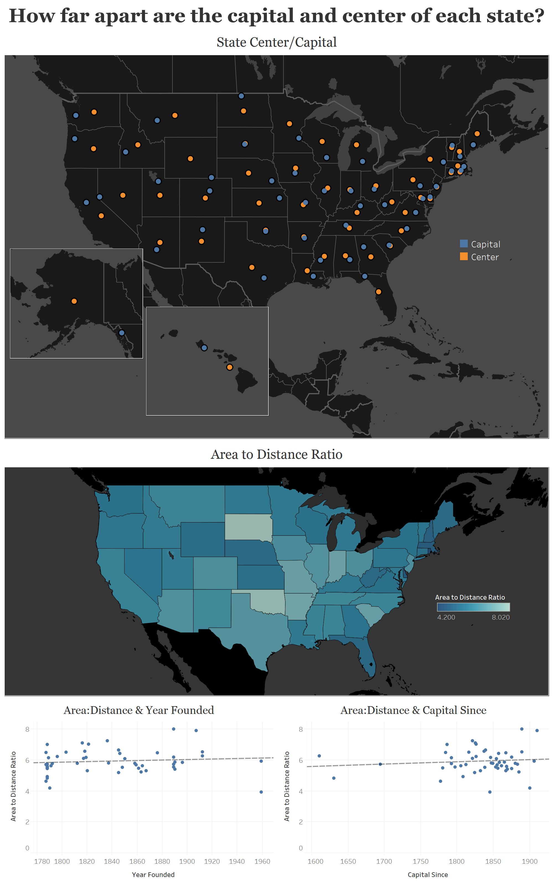

# state-capital-analysis

### Hypotheses

1. The further west you travel, the state capital will be closer to the geographic center of the state.
2. The year each state was founded correlates to the distance between points.
3. The year each state capital was established has an impact on how close to the center it is.

### Step / Methods / Libraries
1. Collect data for States, Geographic Center, Capital Center, Area, etc...
2. Write a script to calculate the distance between the two coordinates
3. Control for size (area) of each state
4. Create a dashboard showing the above hypotheses

geopy - Python library to calculate distance between geo coordinates

vincenty method - Method for calculating the distance (Thaddeus Vincenty, 1975)

Area to Distance ratio - I decided to normalize the states by area. The purpose behind this is to be able to compare how far away from the center of the state each capital is, with respect to its own area. This is not a perfect method, but it gets the states into a comparable state.

### Sources
Data for geographic centers calculated by the USGS (U.S. Geological Survey)

### Dashboard

### Findings / Conclusion
It seems that Year Founded and Capital Since are loosely correlated with the distance from center of each state. None of the above hypotheses can be confirmed with the correlation seen.
